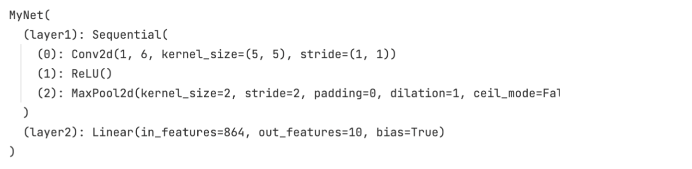
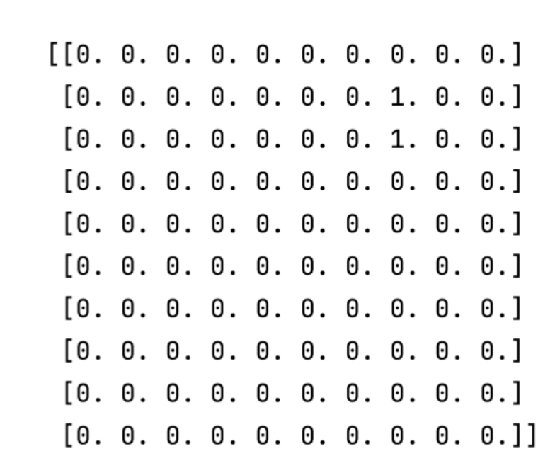

# Overview

The neural network is implemented in train.py and inspired with LeNet5 model.

The original basic net architecture was refined, using convolutions, max-pooling and a fully connected layer.

# Network Architecture

Network architecture of refined network
is as follows.

# Loss function

The nn.CrossEntropyLoss combines nn.LogSoftmax and nn.NLLLoss in one single class, therefore softmax is already included.

# Training loss per batch

Training loss per batch, EWA loss per batch and Validation loss per epoch.

# Additional Analysis

Class Confusion matrix in this case looks as follows. Most confusing to classify seems to be 7. In both cases predicted values were 2, 3 while 7 was classified.

